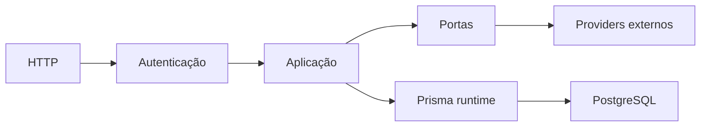

# Visão geral da arquitetura

O template separa entrada HTTP, aplicação, integrações externas e persistência. Os módulos de domínio não dependem de implementações de Firebase, Brevo ou R2; essas integrações ficam atrás de portas e adaptadores.

## Modelo

A autenticação valida o token Firebase e autoriza as roles. Endpoints públicos não exigem token, mas continuam sujeitos às regras específicas de cada rota.

## Operação

A aplicação valida sua configuração na inicialização, expõe health checks e pode exportar telemetria OpenTelemetry. A cadeia de entrega constrói e promove uma imagem OCI única; detalhes estão em [CI/CD](../entrega/ci-cd.md) e [Deploy e recuperação](../operacao/deploy-e-recuperacao.md).
